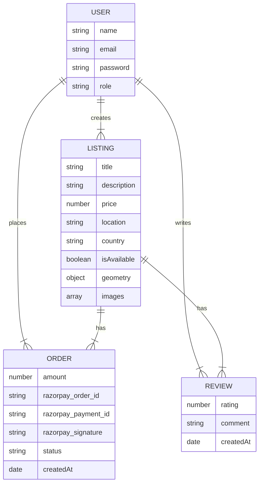

# EzyStay Backend

This is the backend for EzyStay, a modern property rental and booking platform. It is built with Node.js, Express, and MongoDB, providing a robust and scalable foundation for the EzyStay application.

## Features

- **User Authentication**: Secure user registration and login with JWT (JSON Web Tokens).
- **Role-Based Access Control**: Differentiated access for regular users and administrators.
- **Property Listings**: Admins can create, update, and delete property listings.
- **Image Uploads**: Supports multiple image uploads for listings, handled with Multer and ready for a cloud storage solution.
- **Booking System**: Users can book available properties.
- **Payment Integration**: Integrated with Razorpay for seamless and secure payment processing.
- **Reviews and Ratings**: Users can leave reviews and ratings for properties.
- **Admin Dashboard**: Endpoint for an admin dashboard to get a summary of listings, bookings, and revenue.

## Tech Stack

- **Backend**: Node.js, Express.js
- **Database**: MongoDB with Mongoose ODM
- **Authentication**: JSON Web Tokens (JWT)
- **Payment Gateway**: Razorpay
- **Image Handling**: Multer

## ER Diagram

<details>
<summary>Click to view the Entity-Relationship Diagram</summary>



</details>

## Getting Started

### Prerequisites

- Node.js (v14 or later)
- MongoDB
- npm

### Installation

1.  **Clone the repository:**

    ```sh
    git clone https://github.com/Shoury7/EzyStayBackend
    cd EzyStayBackend
    ```

2.  **Install dependencies:**

    ```sh
    npm install
    ```

3.  **Set up environment variables:**

    Create a `.env` file in the root directory and add the following variables:

    ```env
    # JWT
    JWT_SECRET=your_jwt_secret
    ADMIN_SECRET=your_admin_secret

    # MongoDB
    MONGO_URI=your_mongodb_connection_string

    # Razorpay
    RAZORPAY_KEY_ID=your_razorpay_key_id
    RAZORPAY_KEY_SECRET=your_razorpay_key_secret
    ```

4.  **Start the server:**

    ```sh
    npm start
    ```

    The server will be running on `http://localhost:3000` (or the port you configure).

## API Endpoints

### Auth

| Method | Endpoint             | Description             |
| :----- | :------------------- | :---------------------- |
| `POST` | `/api/auth/register` | Register a new user.    |
| `POST` | `/api/auth/login`    | Login an existing user. |

### Listings

| Method   | Endpoint            | Description                              |
| :------- | :------------------ | :--------------------------------------- |
| `POST`   | `/api/listings`     | Create a new listing (Admin only).       |
| `GET`    | `/api/listings`     | Get all listings.                        |
| `GET`    | `/api/listings/me`  | Get listings by the logged-in admin.     |
| `GET`    | `/api/listings/:id` | Get a specific listing by its ID.        |
| `PUT`    | `/api/listings/:id` | Update a listing by its ID (Admin only). |
| `DELETE` | `/api/listings/:id` | Delete a listing by its ID (Admin only). |

### Reviews

| Method   | Endpoint                    | Description                    |
| :------- | :-------------------------- | :----------------------------- |
| `POST`   | `/api/listings/:id/reviews` | Add a review for a listing.    |
| `GET`    | `/api/listings/:id/reviews` | Get all reviews for a listing. |
| `PUT`    | `/api/listings/:id/reviews` | Update a review.               |
| `DELETE` | `/api/listings/:id/reviews` | Delete a review.               |

### Payments

| Method | Endpoint                     | Description                            |
| :----- | :--------------------------- | :------------------------------------- |
| `POST` | `/api/payments/create-order` | Create a Razorpay order for a booking. |
| `POST` | `/api/payments/verify`       | Verify the payment signature.          |

### Summary

| Method | Endpoint                     | Description                            |
| :----- | :--------------------------- | :------------------------------------- |
| `GET`  | `/api/summary/admin-summary` | Get a summary for the admin dashboard. |

## Contributing

Contributions are welcome! Please feel free to submit a pull request.

1.  Fork the Project
2.  Create your Feature Branch (`git checkout -b feature/AmazingFeature`)
3.  Commit your Changes (`git commit -m 'Add some AmazingFeature'`)
4.  Push to the Branch (`git push origin feature/AmazingFeature`)
5.  Open a Pull Request

## License

This project is licensed under the MIT License. See the `LICENSE` file for details.
